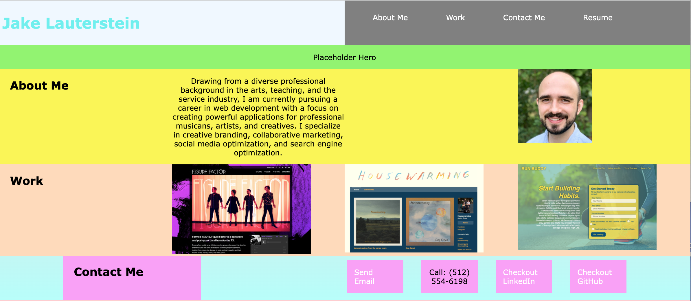

# Project Title: Jake Lauterstein WebDev Portolfio

Use site to navigate Jake Lauterstein's Web Developer Portfolio.

## Description

This site showcases several sites deployed by the author and briefly describes the author's professional background and provides a link to a current resume.

## Getting Started

### Dependencies

  * Utilize an internet browser to load, view, and navigate the site

  * If viewing HTML in VS code, type alt or option + b to load the site into your default browser.

## Author

Jake Lauterstein
jakelauterstein@gmail.com

## Version History

0.1 Initial Release - inital layout and content population was completed in this first draft updated locally, and commited to Github.
0.2 Added more formatting to the contact me section and made sure all links open in new tab
0.3 Added screenshot and README

## Project Screenshot

## Acknowledgments

*https://developer.mozilla.org/en-US/
*https://gist.github.com/DomPizzie/7a5ff55ffa9081f2de27c315f5018afc
